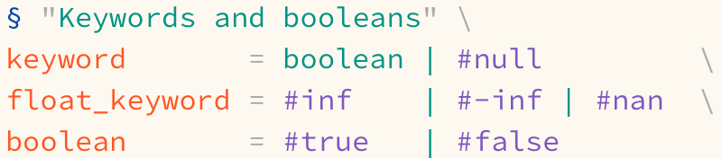
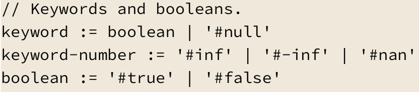

<p align="center">
A Sublime Text 4 syntax highlighting package for the <a href="https://kdl.dev"><b>KDL</b> cuddly document language</a>
</p>

## Introduction

This package adds support for the `KDL` document language, both versions 1 and 2 (for files with `.kdl` extension, but also with `.kdl1`/`.kdl2` if you want to force a specific version)

## Install

- __Via [Package Control](https://packagecontrol.io)__: open `Command Palette` → `Package Control: Install Package` → `kdl`<br>
                                          <kbd>^Ctrl</kbd>/<kbd>⌘Cmd</kbd><kbd>⇧Shift</kbd><kbd>P</kbd>

- __Manually__: clone this repository to your [Packages directory](https://www.sublimetext.com/docs/packages.html) and rename it to `kdl`
```sh
cd /path/to/sublime/packages/directory
git clone https://github.com/eugenesvk/sublime-kdl.git
mv sublime-kdl KDL
```

- Your color scheme likely needs to be patched to ignore or take full advantages of the /-slashdashed comment blocks:
  <br>Patched examples used for the screenshots below: [solarized](./src/ESCombo.sublime-color-scheme), [default](./src/Mariana.sublime-color-scheme)
  - to style /-slashdashed elements with muted colors:
    - add ` -comment` to your scopes, e.g.,
      `{"name":"Tag name","foreground":"var(blue6)","scope":"entity.name.tag -comment"},`
    - add a copy of the same rule with an extra ` comment` scope and a blending color function, e.g.,
      `{"name":"Tag name C","foreground":"color(var(blue6) blend(#000 60% hsl))","scope":"entity.name.tag comment"},`
  - to style /-slashdashed elements like regular comments add `comment.line.slash-dash.kdl` scope to your __Comment__ rule (e.g., `{"name":"Comment","foreground":"black","scope":"comment, comment.line.slash-dash.kdl"},`) so that its 4 level specificity overrides other rules like `entity.other.attribute-name`

## Use

Open any `kdl` file (e.g., [syntax_example_screen.kdl](./test/syntax_example_screen.kdl)) and verify that the selected syntax is `KDL` and KDL-specific contexts are properly scoped[^1] and highlighted, maybe like so (depending on your color scheme):


[^1]: scope naming is supposed to conform to [ST's scope naming guidelines](https://www.sublimetext.com/docs/scope_naming.html)

### Exposed scopes

See a list of scope names in [Scope.md](./Scope.md)

### Keybindings

This plugin adds two keybindings for the `kdl` scope: `"`/`'` that auto-pair double/single quotes even after string modifiers

Add `"kdl.keybind_disable":true` to your `Preferences.sublime-settings` to disable

## Known issues

- Only works in Sublime Text 4 since build __4075__ (10 July 2020) since it's using [version 2](https://www.sublimetext.com/docs/syntax.html) of the syntax
- KDL v2 `"""`multiline string`"""` dedent feature isn't supported, think it's impossible with the ST's syntax engine to use a later match of `spaces before the last """` in all earlier indentation matches
- `/-kdl-version 1` or `2` prefix doesn't affect ST's bottom right syntax indicator, it will still be `KDL` without a version specifier due to the limitations of ST
- `AFileIcon` extension's `Plain Text (KDL)` blank syntax may override this extension's syntax file. As far as I understand, updating to the latest versions of both packages and manually deleting the plain text variant should resolve the [issue](https://github.com/SublimeText/AFileIcon/issues/95).

## Misc

As part of developing this syntax I've significantly reformatted the current grey blob of text that is Spec's grammar into a better structured KDL document with syntax highlighting, see [Grammar2.kdl](./src/grammar2.kdl)



## Credits

The default packages' syntax files ([Python](https://github.com/sublimehq/Packages/blob/master/Python/Python.sublime-syntax), [Bash](https://github.com/sublimehq/Packages/blob/master/ShellScript/Bash.sublime-syntax), [PHP](https://github.com/sublimehq/Packages/blob/master/PHP/PHP.sublime-syntax)), as well as [fish](https://github.com/Phidica/sublime-fish/blob/master/fish.sublime-syntax) and [vscode-kdl](https://github.com/kdl-org/vscode-kdl)
